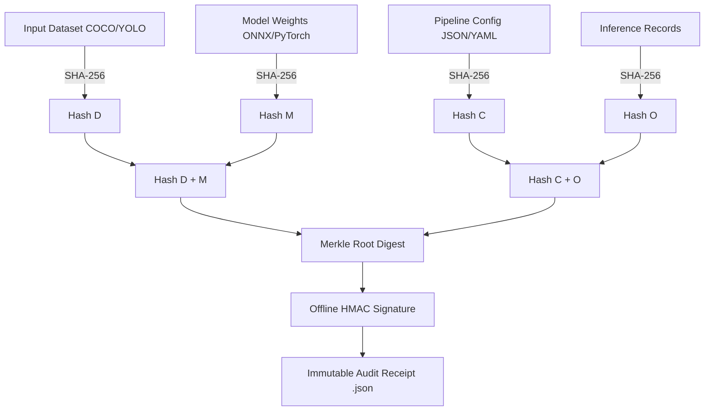

# 🛡️ AEGIS-CV
### *Air-gapped Evidence-based Guardian for Integrity & Security in Computer Vision*

[](https://www.python.org/)
[](#)
[](#)
[](#)

> **"Trust Every Pixel. Verify Every Model. Audit Everything."**

AEGIS-CV is a unified, offline, and model-agnostic assurance framework designed to secure high-stakes Computer Vision pipelines from data poisoning, backdoor trojans, model substitution, distribution shifts, and inference record tampering.

---

## 🚀 Live Demo: Cryptographic Provenance Chain

The cryptographic provenance module (`provenance_chain.py`) mathematically links all pipeline artifacts:
$$\text{Input Dataset} \longrightarrow \text{Model Weights} \longrightarrow \text{Configuration} \longrightarrow \text{Inference Output}$$

It organizes component hashes into a **Merkle Tree**, signs the root digest using an offline **HMAC-SHA256 signature**, and generates a tamper-evident audit receipt.

### ⚡ Quick Start (Run in 5 Seconds)

No heavy external dependencies required (uses standard library):

```bash
# Clone the repository
git clone https://github.com/Vaishnavi-Krishnamoorthy/YHACK26_YS504_GLITCH.git
cd YHACK26_YS504_GLITCH

# Execute the Provenance & Tamper Detection Demo
python provenance_chain.py
```

---

## 🔍 How the Demo Works

The script executes an automated 5-step verification lifecycle:

1. **Pipeline Asset Setup**: Creates realistic sample assets:
   - `sample_data/dataset_coco_sample.json`: Annotations & metadata (COCO format)
   - `sample_data/vision_model_weights.bin`: Simulated CNN/ViT layer weights
   - `sample_data/pipeline_config.json`: Hyperparameters & inference thresholds
2. **Cryptographic Hashing & Merkle Root**:
   - Computes chunked **SHA-256** digests for each file.
   - Constructs a **Merkle Tree** and computes the top-level **Merkle Root**.
   - Generates an offline **HMAC-SHA256 signature** and exports an audit receipt to `receipts/provenance_receipt_baseline.json`.
3. **Baseline Integrity Check (Test 1)**:
   - Verifies the intact pipeline.
   - Evaluates to `100% INTACT` $\rightarrow$ Triage Decision: `ACCEPT ✅`.
4. **Adversarial Tamper Simulation**:
   - Injects a silent backdoor exploit into `pipeline_config.json` (drops `confidence_threshold` from `0.65` to `0.05`).
5. **Offline Tamper Detection (Test 2)**:
   - Re-hashes current files from disk.
   - Detects the broken Merkle chain, pinpoints the exact corrupted file, displays Expected vs. Observed hashes, and triggers an immediate **`QUARANTINE 🚨`** triage action.
   - Restores the clean configuration automatically for reproducible demonstrations.

---

## 📸 Sample Demo Output

```text
================================================================================
 AIR-GAPPED CRYPTOGRAPHIC PROVENANCE & TAMPER-EVIDENT MERKLE ENGINE
 YHACK'26 | Challenge 22 | Team: YS504_GLITCH
================================================================================

[STEP 1/5] Initializing Sample Pipeline Components...
  * 1. Input Dataset (COCO)      -> sample_data\dataset_coco_sample.json
  * 2. Model Weights (Binary)    -> sample_data\vision_model_weights.bin
  * 3. Pipeline Config (JSON)    -> sample_data\pipeline_config.json

[STEP 2/5] Computing Component SHA-256 & Assembling Merkle Tree...
  [SHA-256] 1. Input Dataset (COCO)      : 7d649fa02951cd0b6f8afe1be5ac42c05...
  [SHA-256] 2. Model Weights (Binary)    : 9f34fc9437798b70b88f05cd457424dc...
  [SHA-256] 3. Pipeline Config (JSON)    : 9b4c1070d0f096001065fca38e8f8007...

  +- CRYPTOGRAPHIC MERKLE ROOT (Input -> Model -> Config) ------------+
  | 5647918c81a9ec7356a2a36320cc5405c39afff0983c51c52a4bb39c576b202e |
  +-------------------------------------------------------------------+
  Receipt ID       : AEGIS-RCPT-20461FFAD97F
  HMAC Signature   : 5d688c72ecd62a4645712821235656c1... [OFFLINE VERIFIED]

[STEP 3/5] Verification Test 1: Evaluating INTACT Pipeline Baseline...
  * HMAC Signature Check : [PASSED]
  * Merkle Root Match    : [PASSED]
  >>> VERIFICATION STATUS: [100% INTACT] -> TRIAGE RECOMMENDATION: ACCEPT [OK]

[STEP 4/5] Adversarial Attack Simulation: Tampering with Pipeline Config...
  Target File : pipeline_config.json
  Injecting unauthorized hyperparameter alteration (threshold: 0.65 -> 0.05)

[STEP 5/5] Verification Test 2: AEGIS-CV Offline Tamper Detection...
  * HMAC Signature Check : [PASSED] (Receipt integrity preserved)
  * Merkle Root Match    : [FAILED] (BROKEN CHAIN)
  
  Component Analysis Breakdown:
    * 1. Input Dataset (COCO)    : [INTACT]
    * 2. Model Weights (Binary)  : [INTACT]
    * 3. Pipeline Config (JSON)  : [TAMPER DETECTED]
        Expected Hash    : 9b4c1070d0f096001065fca38e8f8007d35f21bc4904f5feb31184caac344c66
        Observed Hash    : 33b5d1e5871e590466880a02d76084a61db0a844eebc46a059c3945e9bd846aa

  ======================================================================
  CRITICAL INTEGRITY ALERT: PIPELINE COMPROMISED!
  Corrupted Components  : ['3. Pipeline Config (JSON)']
  AEGIS-CV Decision     : QUARANTINE [IMMEDIATE ISOLATION REQUIRED]
  ======================================================================
```

---

## 🏛️ Architecture & Verification Chain



---

## 🛡️ AEGIS-CV 5 Core Engines

| # | Engine | Scope | Supported Formats |
|---|---|---|---|
| **1** | **Data Assurance** | Duplicate, Poison & Mislabelling Probing | COCO, YOLO, VOC XML |
| **2** | **Model Integrity** | Layer Weight Fingerprinting & Backdoor Probing | ONNX, PyTorch, TorchScript |
| **3** | **Inference & Drift** | OOD Detection, Output Tampering & Replay Checks | JSON, Image Digests |
| **4** | **Crypto Provenance** | Hierarchical Merkle Root & Offline Audit Trails | All binary / structured data |
| **5** | **Risk Decision** | Composite Scoring & Triage Action | ACCEPT / REVIEW / QUARANTINE |

---

## 👥 Team YS504_GLITCH | YHACK'26
Challenge 22: Computer Vision Assurance Framework